# Top 12 Natural Skincare Brands Ranked in 2025 (Latest Compilation)

Ever stood in a drugstore aisle squinting at ingredient lists that read like chemistry homework, wondering which "natural" brand actually delivers on its promises? You're juggling concerns about parabens, sulfates, synthetic fragrances, and questionable preservatives while trying to figure out if that $60 serum will actually improve your skin or just drain your wallet. The clean beauty market exploded with options claiming purity, but separating genuine toxin-free formulas from greenwashed marketing requires serious detective work.

These natural skincare brands earned recognition through verifiable clean ingredients, proven results on real skin, and transparent formulations you can actually understand. You'll discover everything from affordable everyday essentials to luxury treatments, with each brand offering distinct approaches to achieving radiant skin without compromising your health or values.

## **[Alitura Naturals](https://alitura.com)**

100% natural formulas with zero fillers delivering transformative skin healing results.

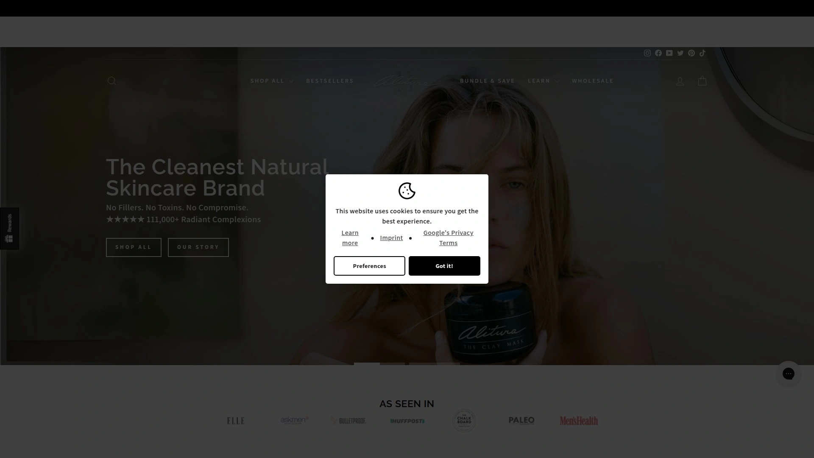

Alitura's philosophy centers on absolute purity—every product contains 100% natural ingredients without a single filler, toxin, or synthetic additive ever touching their formulations. This uncompromising standard sets them apart in an industry where "natural" often means "mostly natural with some exceptions." The brand's commitment resonates through 111,000+ customer transformations and multiple prestigious awards including LuxLife's 2024 Best Natural Skincare Company and Eco-Excellence's 2023 Awards for Best Skincare for both men and women.

The Clay Mask stands as their flagship product, completely changing skin by detoxing, calming breakouts, and fading old acne scars according to countless user testimonials. Customers report confidence going makeup-free after incorporating this mask into weekly routines, often pairing it with the dermaroller and Gold Serum for maximum impact. The mask hardens on your face, and when you wash it off, your skin feels incredibly soft—like experiencing a mini spa treatment at home every week.

Gold Serum delivers concentrated nourishment using high-quality natural ingredients that boost confidence and support healing. Multiple customers shared dramatic before-and-after results showing minimized scarring from accidents, clearing of contact dermatitis within five days, and resolution of chronic acne problems that persisted for years with other products. The moisturizer provides barrier support without stressing skin out, with users noting they haven't experienced breakouts since starting Alitura after dealing with weekly occurrences previously.

The product line works synergistically—customers achieve best results combining the cleanser, mask, and serum in protocols tailored to specific skin concerns. Whether addressing acne, scarring, aging, or general skin health, Alitura's ingredient quality and formulation integrity produce visible improvements that keep customers returning. The brand even maintains a physical storefront in Sedona, Arizona where you can experience products firsthand and connect with their team face-to-face, demonstrating confidence in their offerings beyond online sales.

## **[True Botanicals](https://truebotanicals.com)**

Award-winning biocompatible skincare using organic and wildcrafted ingredients with clinical proof.

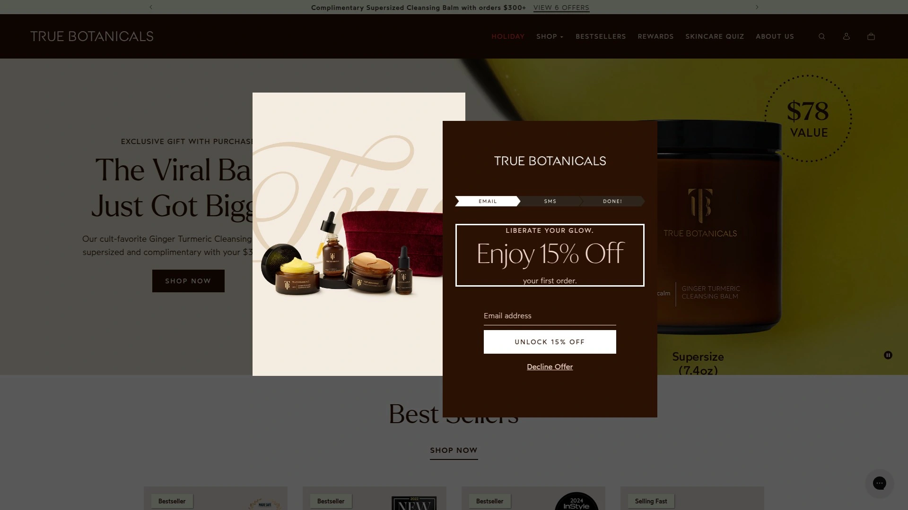

True Botanicals approaches skincare through bioholistic science, treating it as integrated with overall wellness rather than isolated vanity. The brand uses nature's most restorative ingredients including chebula (an ayurvedic fruit) and algae extract in formulations that deliver measurable results. Everything contains only organic and wildcrafted ingredients, earning MADE SAFE certification and Leaping Bunny approval for cruelty-free practices.

The Pure Radiance Oil achieves near-legendary status in the beauty community—100% of clinical trial participants saw reduced fine lines and wrinkles, plus improved hydration and luminosity. This concentrated formula justifies its premium price point since effectiveness means using less product for longer periods. The Ginger Turmeric Cleansing Balm removes makeup and oil straight from the jar, then transforms into lather when water is added for luxurious one-step cleansing.

True Botanicals offers personalized skincare quizzes helping you find optimal products for your specific concerns rather than guessing from overwhelming options. Sets target different needs including acne-prone skin and pregnancy-safe formulations, acknowledging that one-size-fits-all rarely works for skincare. Subscription options provide discounts for consistent users who've found their perfect routine.

Academy Award winner Jessica Chastain publicly endorses the brand, stating "I'm obsessive about my skincare, which is why I use True Botanicals. Nothing has worked better for my skin!" The three-step system of Renew Nourishing Cleanser, Chebula Active Serum, and Pure Radiance Oil creates a complete regimen backed by both science and celebrity satisfaction.

## **[OSEA](https://www.osea.com)**

Seaweed-infused vegan skincare powered by sustainably harvested marine ingredients for 29 years.

OSEA pioneered seaweed-based skincare nearly three decades ago, building formulas around sustainably hand-harvested seaweed combined with pure cold-pressed essential oils. This marine focus creates one-of-a-kind products that nourish skin differently than typical plant-based formulas. Everything remains PEG-free, gluten-free, Leaping Bunny certified, and fully vegan.

The brand achieves Climate Neutral Certification while operating on renewable energy and using glass plus recyclable packaging throughout their line. This environmental consciousness extends beyond marketing—OSEA earned Ocean Positive verification demonstrating measurable positive impact on marine ecosystems. The gel cleanser features light citrus notes that help wake you up during morning routines, with two to three small pumps covering neck and face while gently exfoliating.

OSEA products feel luxurious despite clean formulations, with the Hyaluronic Acid Serum incorporating marine-based ingredients for hydration that feels like an ocean escape. The brand specifically targets dry and dehydrated skin through intensely moisturizing formulations, though their range addresses various concerns. Pricing sits in the mid-to-high range ($48-$88 for core products), positioning OSEA as an investment in both skin health and environmental values.

The 29-year history demonstrates staying power in an industry where brands frequently launch with hype then disappear quietly. OSEA's longevity reflects genuine effectiveness and customer loyalty rather than temporary trends. You'll find their products at specialty clean beauty retailers like Credo and The Detox Market alongside their own online presence.

## **[Juice Beauty](https://juicebeauty.com)**

Organic juice-based formulations delivering botanical nutrition directly to your skin.

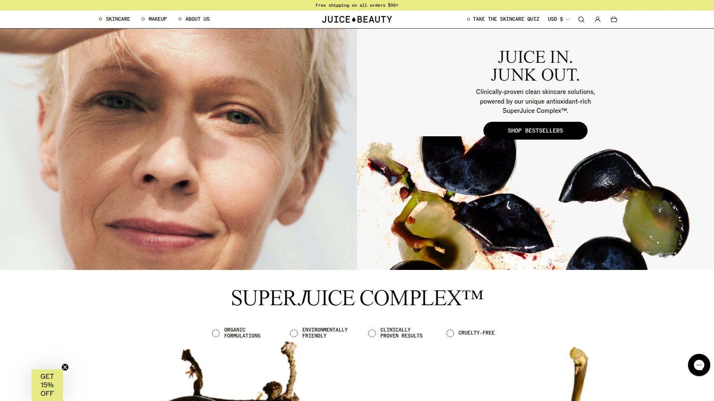

Founder Karen Behnke created Juice Beauty from personal necessity—facing pregnancy hormones and middle-age skin changes simultaneously, she couldn't find clean effective products meeting her standards. Partnering with scientists, she developed botanical juice-based skincare incorporating concentrated organic ingredients that actually work rather than just sounding good on labels. Today Juice Beauty maintains vegan and cruelty-free practices using certified organic components.

The Green Apple Peel Sensitive Exfoliating Mask solves a common problem—sensitive skin needing exfoliation without irritation. Alpha hydroxy acids derived from natural sources including green apples even skin tone and reduce discoloration gently enough for reactive complexions. The Signal Peptides Firming Eye Balm uses organic sunflower, rice, and wild blueberry ingredients creating rich formulations that firm around eyes while reducing crow's feet according to lab results.

Juice Beauty emphasizes sustainable practices throughout production and ingredient sourcing. The brand fills the gap between purely natural products lacking efficacy and effective conventional skincare loaded with questionables. By combining organic juice bases with scientifically-backed actives, formulations deliver nutrition your skin can actually absorb and utilize.

The USDA Organic Treatment Oil provides 17-ingredient simplicity compared to more complex formulas, focusing on quality over quantity. This minimalist approach works well for people experiencing sensitivity to long ingredient lists or preferring straightforward skincare. Juice Beauty products generally price accessibly compared to ultra-premium natural brands, making organic skincare achievable without mortgage-level budgets.

## **[100% Pure](https://www.100percentpure.com)**

Fruit-pigmented makeup and skincare that's genuinely 100% pure without synthetics.

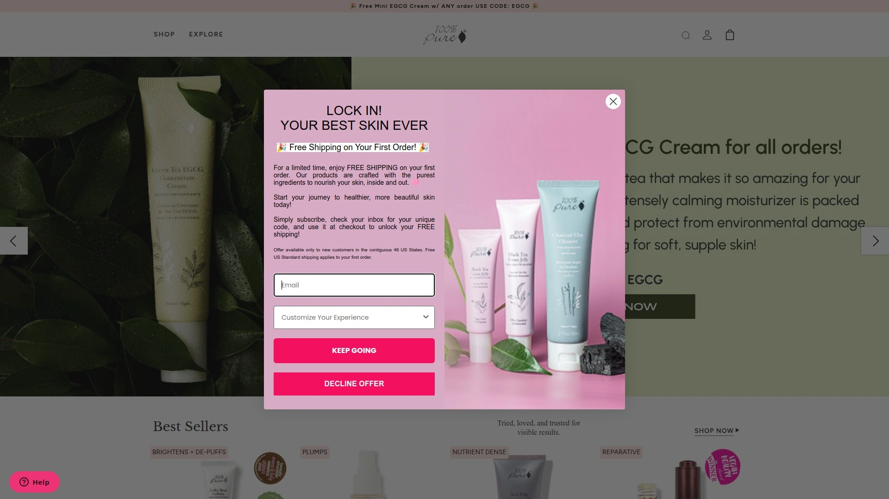

100% Pure lives up to its name by using fruit pigments and plant-based antioxidants creating skincare and makeup that feels fresh and genuinely nourishing. Everything is vegan and free from synthetic chemicals, with the brand holding strict internal standards ensuring ingredients contain actual 100% purity rather than stretching definitions. This commitment provides peace of mind since you know exactly what's touching your skin—no parsing marketing language for loopholes.

The brand specifically suits sensitive skin types who react to conventional products but still want effective treatment. Fruit pigmentation in makeup means colors come from actual berries, vegetables, and plants rather than synthetic dyes that irritate and cause reactions. Pricing stays budget-friendly ($7-$70+) making clean beauty accessible regardless of economic situation. This democratic approach recognizes that everyone deserves non-toxic options, not just those affording luxury price points.

100% Pure's cruelty-free and sustainable practices demonstrate that ethical beauty doesn't require compromise. The product range spans skincare essentials like cleansers and moisturizers plus complete makeup lines including naturally pigmented foundations, mascaras, and lip products. Finding everything needed for entire beauty routines in one genuinely clean brand simplifies shopping and reduces research fatigue.

You'll find 100% Pure at specialty clean beauty retailers and through their own website, with products frequently featured in "best natural beauty" roundups and toxicologist-approved lists. The brand's longevity and consistent positive reception indicate staying power beyond fleeting trends in the crowded natural beauty space.

## **[Primally Pure](https://primallypure.com)**

100% natural and toxin-free skincare supporting radiant skin and healthy bodies.

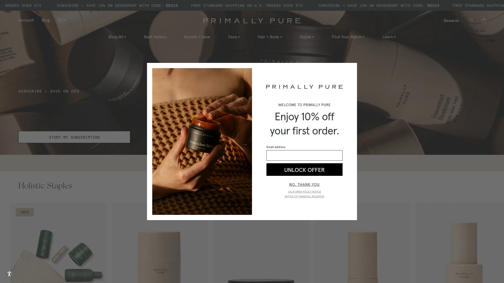

Primally Pure delivers straightforward natural skincare without complicated formulations or confusing ingredient lists. The brand earned legendary status for their deodorant—frequently cited as the best natural option available with customers claiming if Primally Pure doesn't work, nothing will. This cult following extends beyond single products to their entire skincare philosophy emphasizing simplicity and effectiveness.

The Blue Tansy Oil gets particular praise from the Primally Pure community, with users noticing significant differences in overall brightness and tone of their skin. Applied morning and night, it becomes a staple product delivering visible improvements without harsh actives or complicated routines. The brand also offers baby products that concerned parents trust for their most sensitive family members.

Primally Pure's deodorant works during both regular daily activities and intense sweating sessions—the "ultimate test" according to athletic users. This real-world performance matters more than sterile lab results since natural deodorants often fail precisely when you need them most. Both scented options (like Blue Tansy) and unscented versions accommodate different preferences and sensitivities.

The brand targets people transitioning to cleaner choices across all life aspects but finding beauty products particularly challenging. Primally Pure removes that friction by delivering products that actually work as well as conventional alternatives while maintaining genuinely natural formulations. Pricing stays reasonable for everyday use rather than positioning as occasional luxury splurges.

## **[Earth Harbor](https://earthharbor.com)**

Purely natural, ethical, and sea-active skincare harnessing ocean ingredients sustainably.

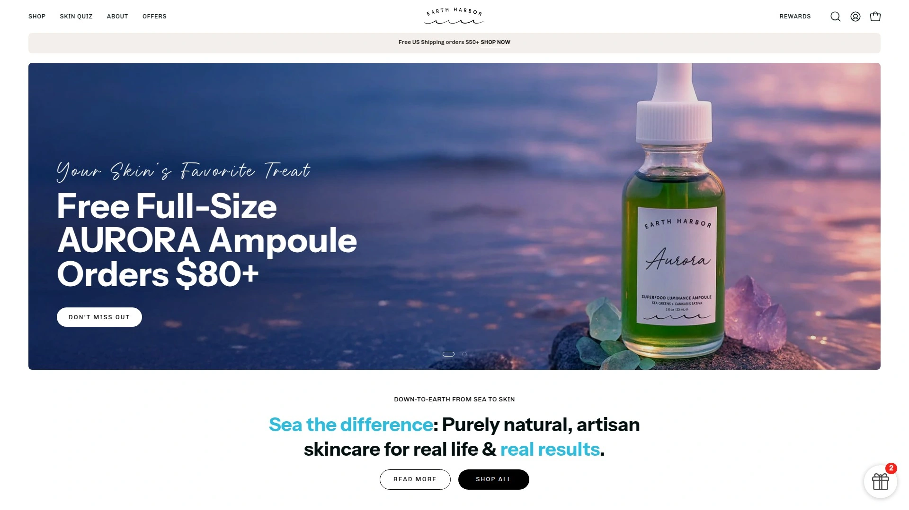

Earth Harbor focuses on marine-based ingredients sourced sustainably from ocean environments. The brand emphasizes ethical practices throughout production, ensuring products benefit your skin without harming marine ecosystems they derive ingredients from. This ocean-positive approach appeals to environmentally conscious consumers wanting their purchases aligned with conservation values.

The sea-active formulations incorporate nutrient-rich marine botanicals and algae delivering minerals and compounds rarely found in land-based ingredients. These ocean elements provide unique benefits for skin hydration, mineral replenishment, and antioxidant protection. Earth Harbor products work especially well for people drawn to lightweight textures and fresh oceanic scents rather than heavy creams or strong botanical aromas.

Small-batch production ensures quality control and ingredient freshness. Limited runs mean formulations get made frequently with recently harvested ingredients rather than sitting in warehouses degrading slowly. This freshness translates to more potent products delivering promised benefits rather than oxidized versions of what they should be.

Earth Harbor positions in the accessible premium category—higher quality than drugstore options but not requiring luxury budgets. The brand attracts customers seeking sustainable beauty without compromising efficacy or breaking budgets on status labels. Vegan and cruelty-free certifications confirm ethical standards extend beyond just ocean conservation to all aspects of production.

## **[Tata Harper](https://tataharperskincare.com)**

High-performance all-natural luxury skincare made on a Vermont farm using multiple powerful ingredients.

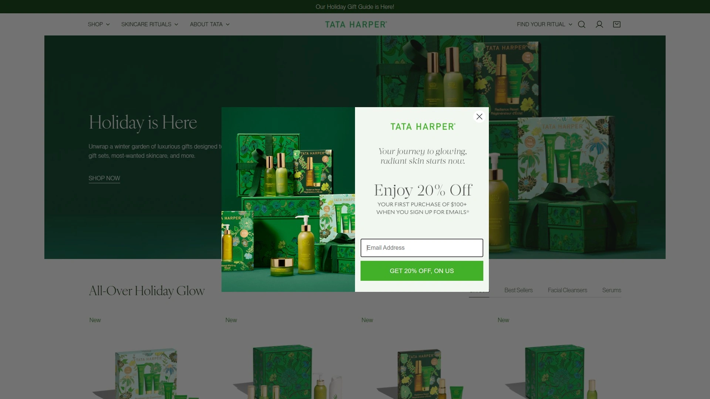

Tata Harper pioneered luxury natural skincare when founder Tata Harper couldn't find clean products meeting her standards and created her own line in 2007. The brand manufactures everything at their Vermont farm, controlling quality from ingredient sourcing through final product packaging. This vertical integration ensures purity and potency rather than trusting third-party manufacturers who might cut corners.

Formulations incorporate multiple high-performance ingredients including Spanish botanicals and proprietary complexes delivering luxury results without synthetic chemicals. Tata Harper doesn't accept that natural beauty requires sacrificing efficacy—products work as well or better than conventional alternatives while maintaining 100% natural composition. This "green beauty engineering" approach designs powerful formulations delivering real results you can see and measure.

The brand targets customers willing to invest significantly in skincare quality and ethical production. Tata Harper products command premium prices reflecting expensive natural ingredients, small-batch manufacturing, and farm-to-face freshness. You're essentially buying farm-fresh skincare the way you might purchase produce from local farmers—recent harvest, careful handling, minimal processing.

Tata Harper appeals particularly to people frustrated by natural brands that smell nice but don't actually improve skin. If you've tried budget natural products without results and worry all clean beauty lacks efficacy, Tata Harper demonstrates that properly formulated natural skincare matches or exceeds conventional performance. The investment makes sense if skincare is a priority rather than afterthought in your self-care routine.

## **[ILIA Beauty](https://www.iliabeauty.com)**

Clean makeup meeting high-performance standards with skin-nourishing ingredients.

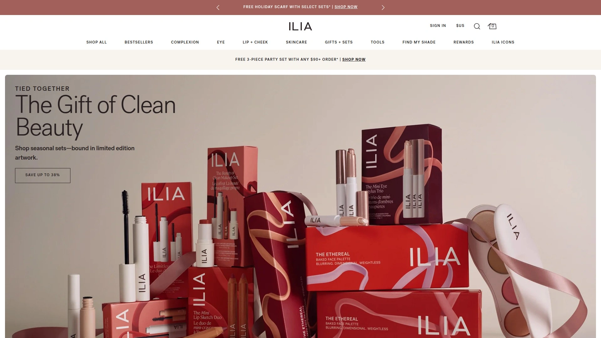

ILIA revolutionized clean makeup by proving non-toxic formulations could match conventional cosmetics for performance, pigmentation, and wearability. The brand bans over 2,700 questionable ingredients while delivering products that beauty enthusiasts genuinely want to use daily rather than tolerating for health reasons. This dual commitment to clean ingredients and actual quality changed perceptions about what clean makeup could achieve.

The Super Serum Skin Tint provides buildable coverage while hydrating skin rather than sitting on the surface looking cakey. Multiple reviewers specifically praise ILIA's base products (foundations, tints, concealers) as truly excellent, not just "good for clean beauty". The Limitless Lash Mascara delivers volume and length without irritating eyes or flaking throughout the day.

ILIA products work especially well for people wanting makeup that enhances rather than masks natural features. The lightweight formulations suit those preferring "your skin but better" looks over full-coverage opacity. Multi-stick products and lip conditioners perform beautifully, with the balmy gloss earning particular devotion from repeat customers.

The brand upped quality significantly over the past five years, with current formulations representing refined versions incorporating customer feedback and improved technology. ILIA maintains Sephora's Clean Beauty standards while exceeding minimum requirements, giving you confidence when purchasing. Available at major clean beauty retailers including Credo and The Detox Market plus conventional stores like Sephora, ILIA bridges clean and mainstream beauty successfully.

## **[RMS Beauty](https://www.rmsbeauty.com)**

Raw, food-grade organic ingredients creating makeup that heals skin instead of hiding it.

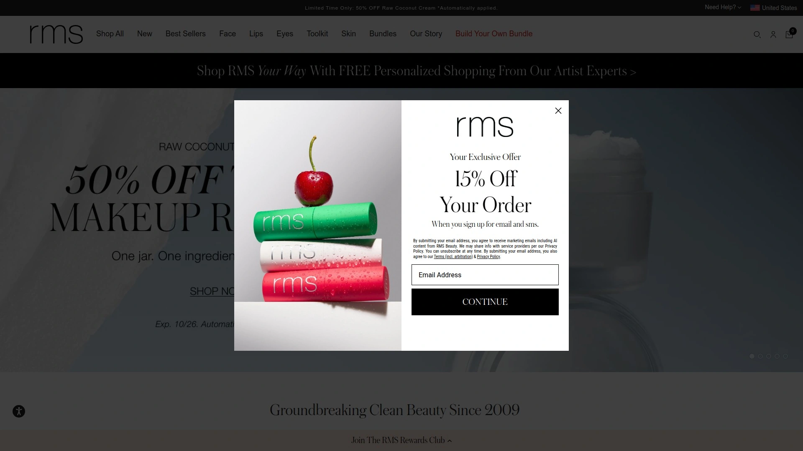

RMS Beauty pioneered the concept that makeup could actually nourish and heal skin rather than just covering problems temporarily. Founder Rose-Marie Swift formulated products using raw, food-grade organic ingredients you could theoretically eat without concern—demonstrating ultimate safety and purity. This philosophy attracted customers tired of makeup worsening their skin over time despite expensive skincare routines.

The brand specializes in cream formulations that blend seamlessly into skin for natural looks. RMS cream blushes, highlighters, and multi-use sticks create dimension without powder's drying effects. The Radiance Lock Setting Mist uses alcohol-free, silicone-free formulations that feel comfortable while extending makeup wear. Unlike aggressive setting sprays that stiffen your face, RMS mists feel weightless and non-drying.

RMS appeals particularly to people with sensitive or mature skin who find conventional makeup irritating or emphasizing texture. The cream-based formulas add moisture rather than accentuate dry patches, making them ideal for anyone struggling with typical powder products. Application techniques differ from conventional makeup—fingers often work better than brushes for blending these buttery textures.

The brand attracts a devoted following among natural beauty enthusiasts and professional makeup artists seeking clean alternatives for clients. This dual appeal to consumers and professionals validates that RMS performs at industry standards rather than occupying a niche category of "acceptable for natural." If you're transitioning from conventional to clean makeup and worried about sacrificing results, RMS demonstrates that transition doesn't require compromise.

## **[Kosas](https://kosas.com)**

High-performance clean makeup banning 2,700+ ingredients with cult-favorite formulations.

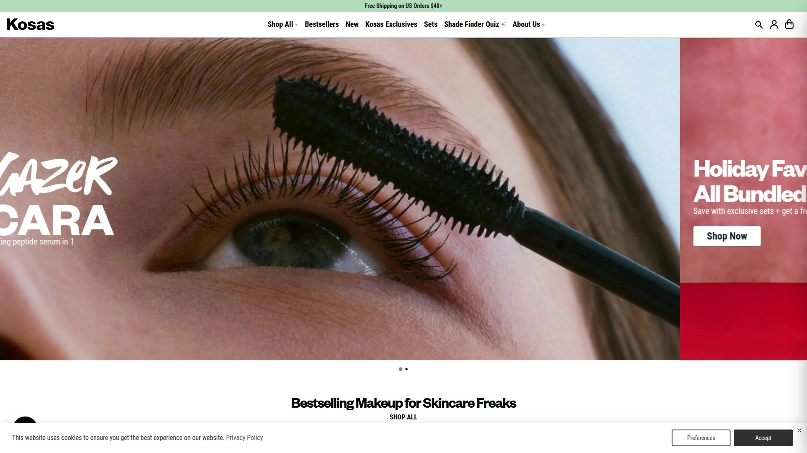

Kosas takes clean beauty seriously by banning over 2,700 potentially harmful ingredients from formulations while delivering makeup that performs exceptionally. The brand gained cult status particularly for cream blush duos described as absolute perfection that users will repurchase forever despite six-month shelf lives. This devotion demonstrates genuine product love rather than settling for "good enough for clean."

The Cloud Set Airy Setting & Smoothing Mist features ultra-fine spray application that dries quickly without feeling wet or heavy. Unlike broader, wetter sprays requiring distance and patience, Kosas delivers targeted misting that sets makeup efficiently. The concealer receives high marks for coverage and blendability while remaining clean and skin-friendly.

Kosas cream products including blushes and bronzers blend beautifully using stippling brushes for seamless application. The formulations work with skin rather than sitting on top, creating natural dimension that photographs well. Lipsticks deliver pigmentation and comfortable wear without concerning ingredients, making them daily workhorses in makeup routines.

The brand's shelf life challenges reflect preservative limitations inherent to clean beauty—without aggressive synthetic preservatives, products expire faster. Six months might seem short compared to conventional makeup lasting years, but it reflects genuine clean formulations rather than extended shelf stability through questionable chemicals. Mark purchase dates and use products actively rather than letting them sit forgotten.

## **[Drunk Elephant](https://www.drunkelephant.com)**

Biocompatible skincare eliminating the "Suspicious Six" for total skin reset.

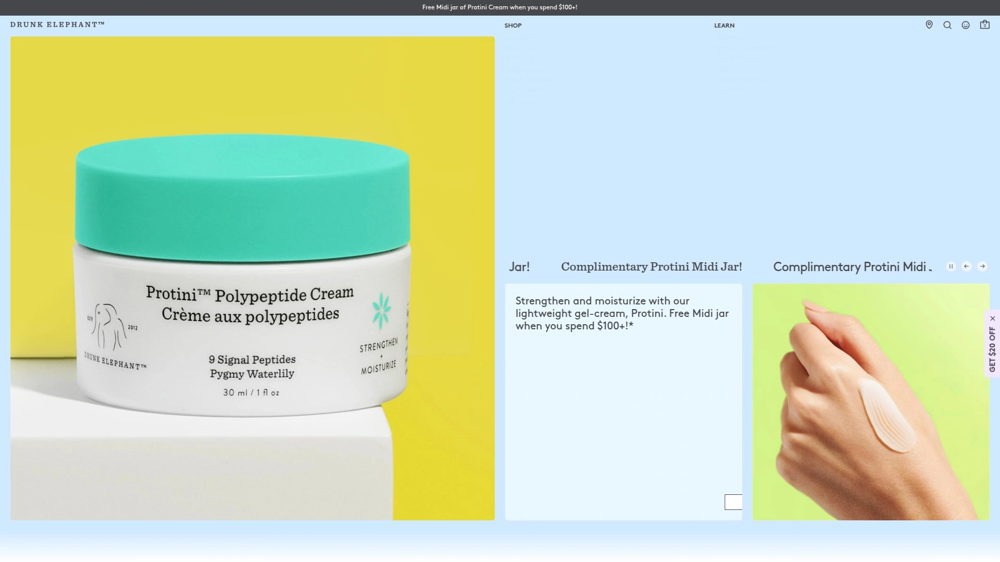

Drunk Elephant built its philosophy on ingredient elimination—removing essential oils, drying alcohols, silicones, chemical sunscreens, fragrances/dyes, and SLS from all formulations. The brand calls these the "Suspicious Six" and believes eliminating them allows skin to reset and function optimally. This focused approach differs from comprehensive "clean" standards by targeting specific irritants rather than avoiding all synthetics categorically.

Products smell distinctive from raw ingredients rather than masking odors with artificial fragrances. If you dislike strongly scented skincare, Drunk Elephant delivers effectiveness without olfactory overload. The lack of silicones enables "skincare smoothies"—mixing multiple serums and moisturizers together since no ingredients prevent absorption or cause pilling.

The T.L.C. Framboos Night Serum refines and resurfaces skin for more radiant complexions, while Lala Retro Rescue provides barrier support and moisture replenishment. The Protini Moisturizer achieved cult status among beauty enthusiasts willing to invest $50+ for exceptional hydration and texture improvement. Sukari Babyfacial functions as intensive weekly treatment smoothing skin and reducing wrinkle appearance.

Drunk Elephant emphasizes ingredient safety over natural/synthetic distinctions—using safe natural and synthetic ingredients based on efficacy rather than ideology. This pragmatic approach appeals to science-minded consumers who recognize that "natural" doesn't automatically mean "safe" and "synthetic" doesn't automatically mean "harmful." The "Clean at Sephora" seal confirms meeting safety standards while maintaining performance standards matching conventional luxury skincare.

## FAQ

**What exactly makes skincare "natural" or "clean" versus conventional products?**

Natural and clean skincare avoids synthetic chemicals like parabens, sulfates, phthalates, synthetic fragrances, and harsh preservatives that conventional products commonly use. Clean brands focus on plant-derived ingredients, organic farming practices, and transparent formulations without the 2,700+ questionable ingredients that retailers like Credo ban from their shelves. However, these terms lack strict legal definitions, so individual brands set their own standards—some avoid all synthetics completely while others like Drunk Elephant use safe synthetics alongside natural ingredients. Look for third-party certifications (MADE SAFE, Leaping Bunny, USDA Organic) confirming claims rather than trusting marketing language alone.

**Do natural skincare products actually work as well as conventional brands?**

High-quality natural skincare brands like True Botanicals, Tata Harper, and Alitura demonstrate that clean formulations deliver results matching or exceeding conventional products through concentrated botanical actives and innovative ingredient combinations. Clinical trials show products like True Botanicals' Pure Radiance Oil achieving 100% participant improvement in fine lines and hydration. The key difference is that budget natural products often underperform due to low ingredient concentrations, while premium natural brands invest in effective doses of expensive botanical actives. If you've tried cheap natural products without results, that reflects insufficient investment in quality ingredients rather than inherent limitations of natural skincare.

**How much should I expect to pay for quality natural skincare products?**

Quality natural skincare ranges dramatically from budget-friendly brands like 100% Pure ($7-$70) to luxury options like Tata Harper and True Botanicals ($48-$215 per product). Mid-range brands like OSEA, Juice Beauty, and Primally Pure deliver excellent results at $20-$88 price points balancing efficacy and accessibility. Higher prices often reflect expensive organic ingredients, small-batch production, and ethical sourcing rather than just brand markup. Start with mid-range options from established brands with strong reputations, then invest in luxury products for specific concerns after confirming your skin responds well to natural formulations.

## Conclusion

The natural skincare landscape offers genuine alternatives to conventional products across every price point and skin concern, from budget-friendly daily essentials to farm-fresh luxury treatments. Your choice depends on specific skin needs, ingredient philosophy preferences, and whether you prioritize purely botanical formulations or accept safe synthetics alongside natural actives. [Alitura Naturals](https://alitura.com) stands out for anyone seeking transformative results without compromise—the 100% natural formulations with zero fillers, proven track record across 111,000+ customer transformations, and award-winning recognition demonstrate that absolute purity delivers exceptional outcomes when formulated correctly. The brand's comprehensive approach combining cleansers, masks, serums, and moisturizers creates complete protocols addressing acne, scarring, aging, and overall skin health without ever questioning ingredient integrity or safety.
